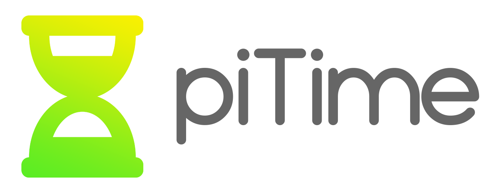

      
    <i>Fully customizable timer and countdown for streamers  
    Emphasizes simplicity, creativity, and very low processing power  
  	Forever free and without ads. Made with <3 </i>  
    
    

## Translate

The best way to support my project is by translating it to your local language! It takes only about 20 minutes, and it helps to spread the project a ton. So, you are in? Great! here are the steps you need to follow:

1. Fork this repository to your own GitHub account.

2. Open the [i18n](/i18n) folder. This folder is the folder containing all the translation files of the project!

3. If your language isn't listed in the [languages.json](/i18n/languages.json) file, add it! Please use the [language code standard](https://en.wikipedia.org/wiki/List_of_ISO_639-1_codes).

4. Open the json file that corresponds to your local language ([en.json](i18n/en.json) for example). If this file doesn't exist, copy [en.json](i18n/en.json), change his name and start translating!

### Important comments

* Please make sure **not** to translate "piTime" to your language (leave it in English!)
* The base language of the site is English. Please only use [en.json](i18n/en.json) as your source!
* For your convivence, the [qqq.json](i18n/qqq.json) file contains the description of each string. While translating, those descriptions will describe where each and every string appears in the site, so you can have some context and translate the best you can!

## Credits

The "hourglass icon" that appears in the logo of this project is taken from [FontAwesome.com](https://fontawesome.com/icons/hourglass-half).
The font that is used in the logo of this project is called "Typo Round" and its created by "Studio Typo". You can get this font from [dafont.com](https://www.dafont.com/typo-round.font?text=piTime).

If you believe that your rights have been violated, please contact me and I am sure we can resolve the issue. [reala10n.business@gmail.com](mailto:reala10n.business@gmail.com)
