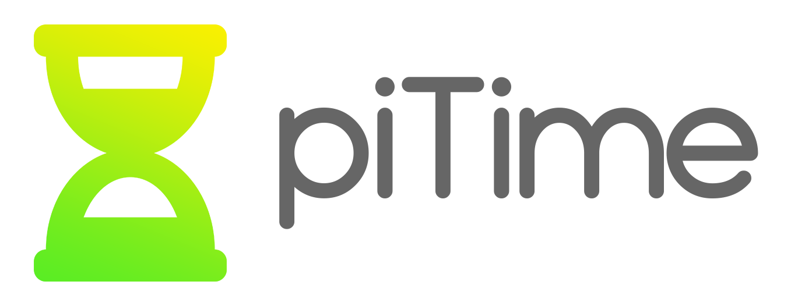

      
    <i>Fully customizable timer and countdown for streamers  
    Emphasizes simplicity, creativity, and very low processing power  
  	Forever free and without ads. Made with <3 </i>  
    
    

## Credits

The "hourglass icon" that appears in the logo of this project is taken from [FontAwesome.com](https://fontawesome.com/icons/hourglass-half).
The font that is used in the logo of this project is called "Typo Round" and its created by "Studio Typo". You can get this font from [dafont.com](https://www.dafont.com/typo-round.font?text=piTime).

If you believe that your rights have been violated, please contact me and I am sure we can resolve the issue. [reala10n.business@gmail.com](mailto:reala10n.business@gmail.com)
